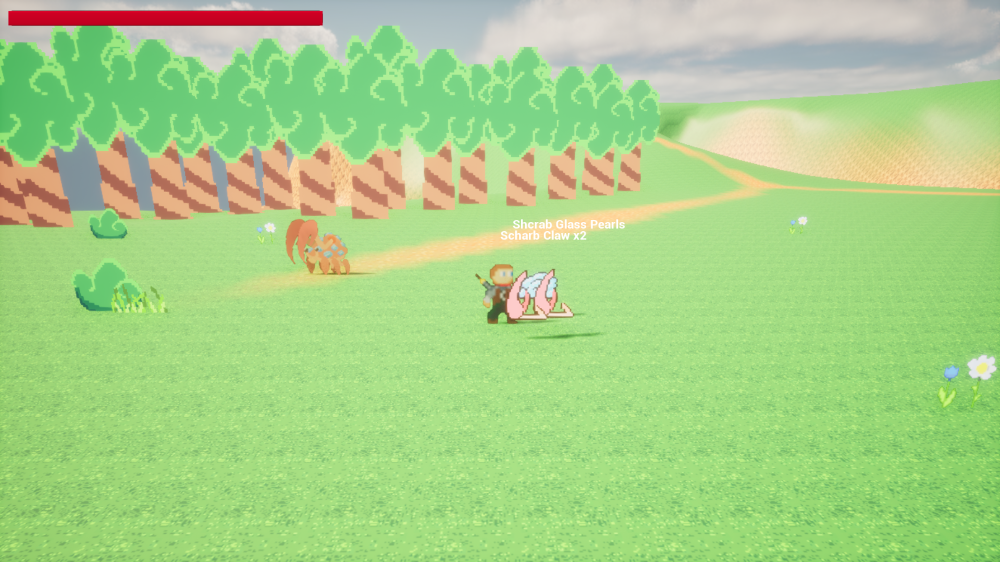
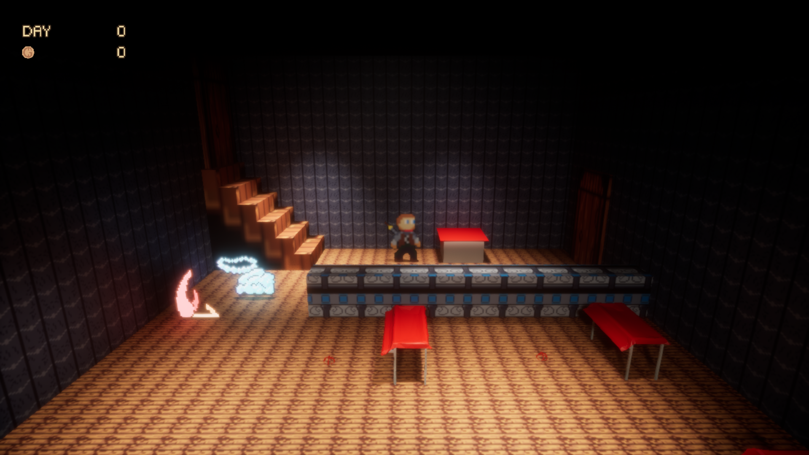
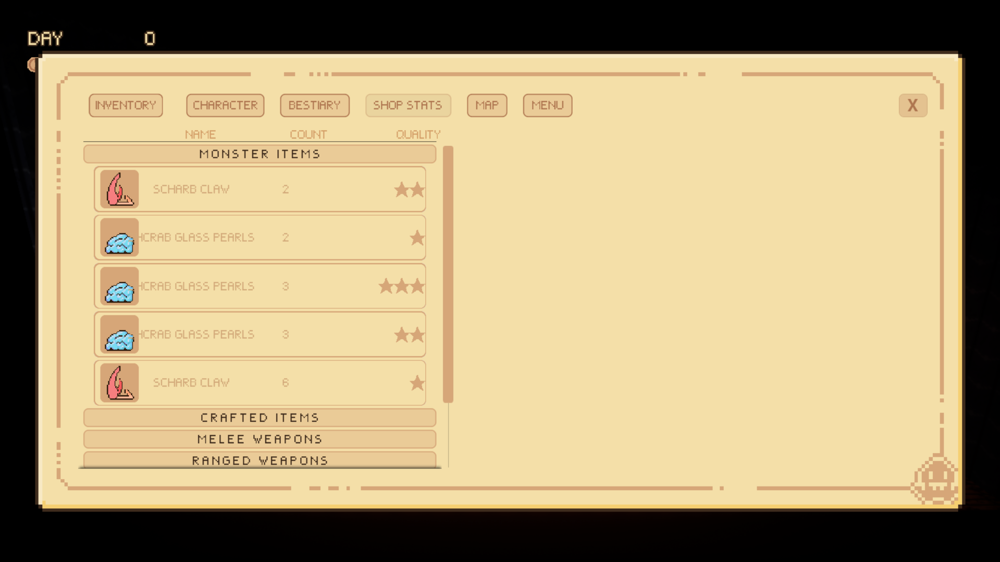
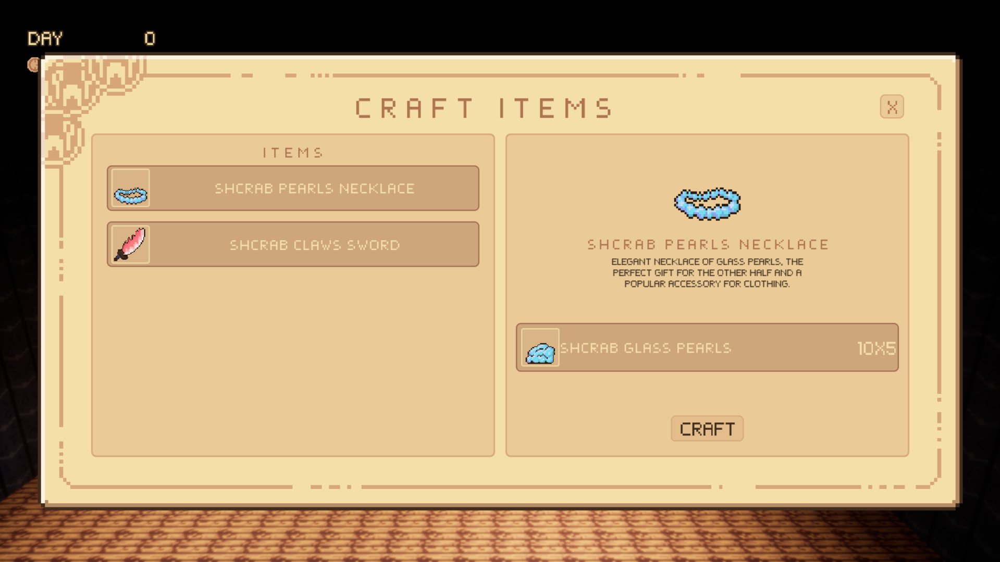
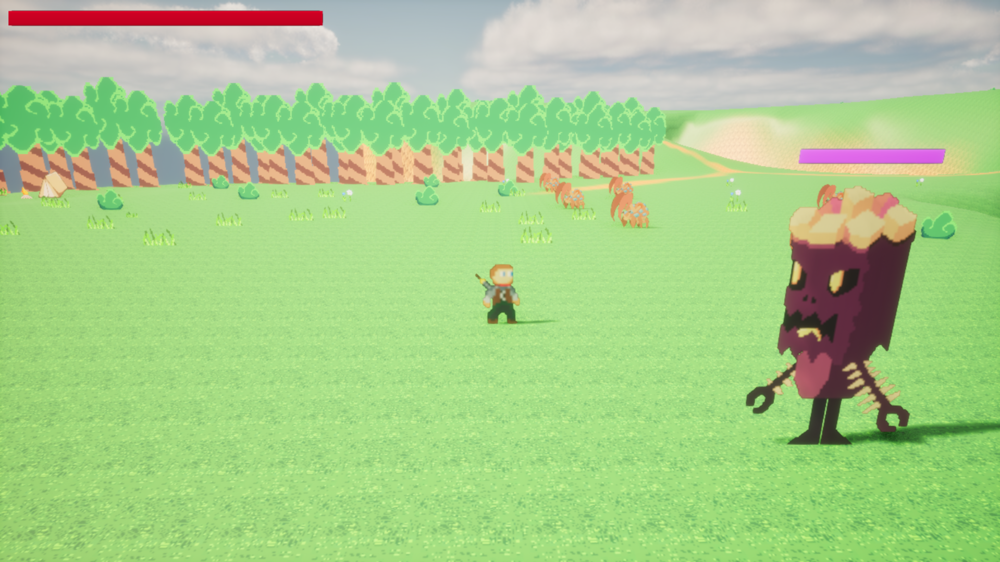
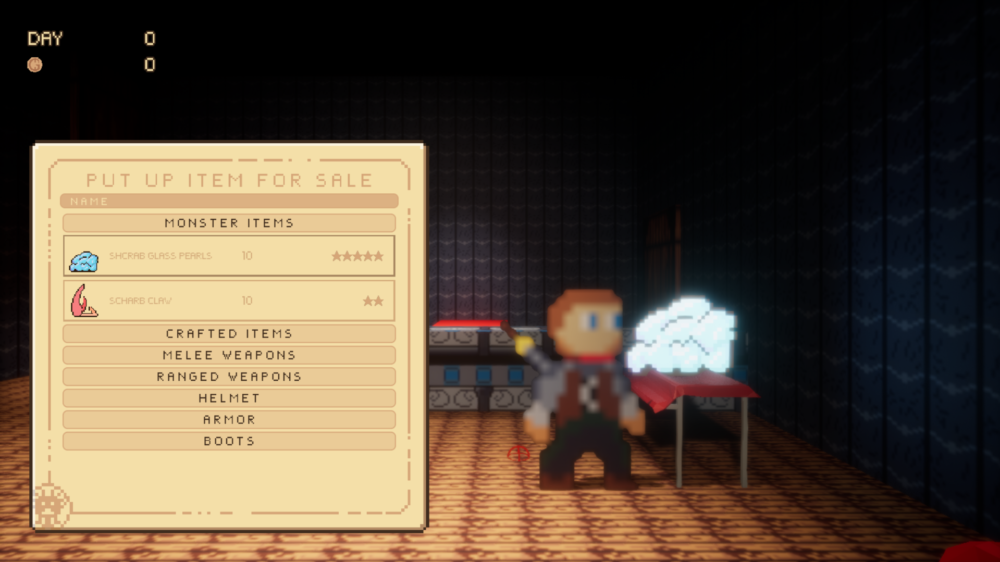
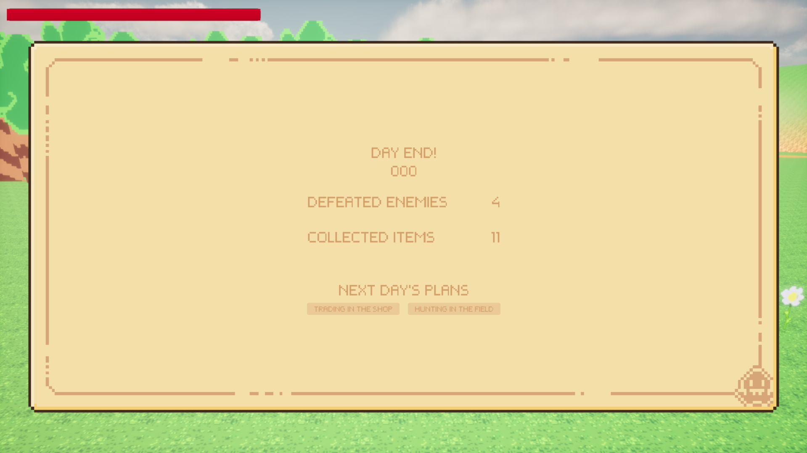

# BeastMarket

**BeastMarket** is a **2.5D Action–Economy game** developed as a **student project** by a team of three people.  
The project is currently in *concept demo* and will be developed in the future.

---

## 📌 Game Concept

The player runs a shop that sells items crafted from materials obtained by hunting monsters.  
Since the player operates a business, they must **pay taxes regularly**.  
The game continues indefinitely until the player dies during a hunt or is unable to pay taxes.

Gameplay is divided into **two main sequences**:
- shop management
- monster hunting

These two activities cannot be performed at the same time, forcing the player to **plan each day carefully**.

---

## 🏪 Store Mode

The store consists of two main areas:

### Backroom
- crafting items for sale
- crafting or upgrading equipment for the player

### Main Hall
- placing items on dedicated exhibition stands
- opening the shop, which starts the trading day

When the shop is open:
- NPC customers arrive
- each customer has:
  - a limited amount of money
  - personal preferences and tastes
  - quality requirements
- customers buy items only if:
  - the item matches their preferences
  - the quality meets their expectations
  - they can afford it

Some customers are **special NPCs**:
- initiate unique interactions
- introduce quest elements
- expand the world lore

Additional systems:
- **trend / fashion system** (some items become more popular than others)
- kingdom events affecting the economy
- information gathered through:
  - morning newspapers
  - conversations with customers

At the end of the day:
- the shop closes
- the player prepares items for the next day or for hunting

---

## ⚔️ Hunting Mode

When choosing to hunt:
- the player starts in the shop
- the shop cannot be opened
- only preparation in the backroom is possible

The player then selects a hunting area from the world map.

Hunting areas:
- semi-open regions connected by smaller zones
- enemies with increasing difficulty
- each region contains a boss
- defeating a boss unlocks a new region

Exploration features:
- environmental puzzles
- obstacles and challenges
- varied regions to diversify gameplay

The player can hunt freely, limited only by:
- backpack capacity
- inventory upgrades increasing carrying capacity

Returning to the shop ends the day.

---

## 🎨 Visual Style

The game is visually inspired by the **HD-2D style** known from Square Enix titles  
(e.g. *Octopath Traveler*).

---

## 🚧 Project Status

This description presents a **wider vision** of the game's design. 
The current build includes a **partial implementation** of these mechanics, developed within the scope of a university *Game Programming* course.

---

## 👤 My Role in the Project

**Responsibilities:**
- original game concept
- team coordination and direction
- UI design
- UI and enemy graphics

**Technical contributions:**
- item system
- inventory system
- UI systems

### Inventory System
Inspired by *Kingdom Come: Deliverance*:
- items are categorized by type and quality
- when picking up an item:
  - its type is detected
  - it is placed in the corresponding container
  - if an item with the same name and quality exists → its quantity is increased
  - otherwise, a new entry is created
- the same logic applies to dropping items

### Crafting System
- each craftable item has a recipe
- the system checks:
  - item type and name
  - ignores ingredient quality
- if quantities match:
  - a new item with a predefined quality is crafted

---

### Defeating an Enemy

### Shop Interior

### Inventory System

### Crafting

### Hunting Area

### Exhibiting Items

### End of the Day

*Created by: Mateusz Gozdek, Oskar Firlej, Mateusz Fundowicz*
